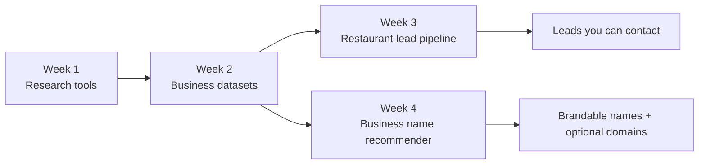
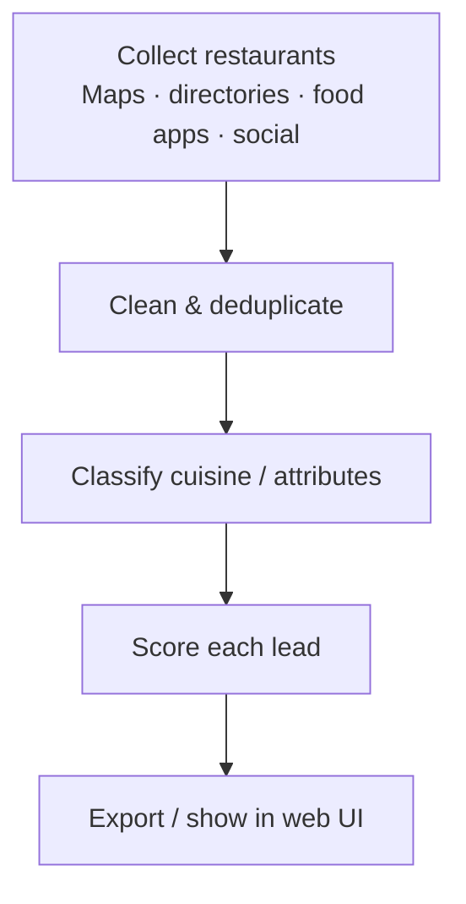
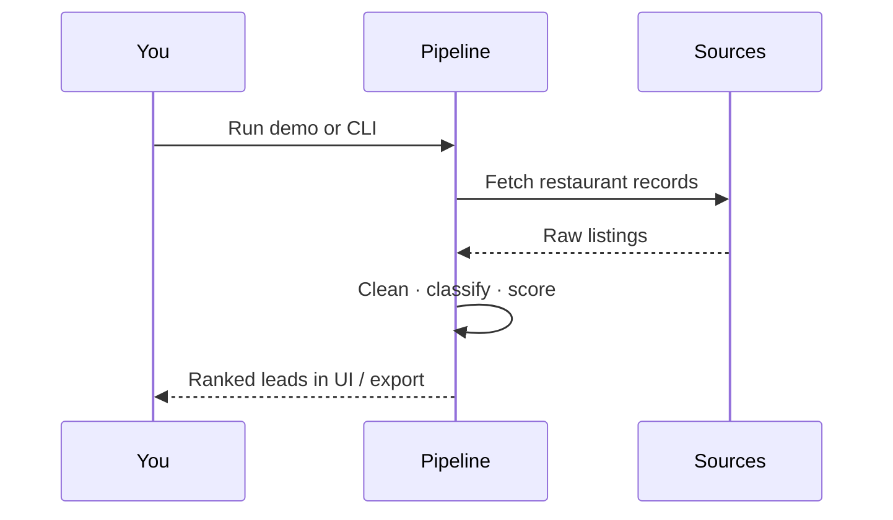
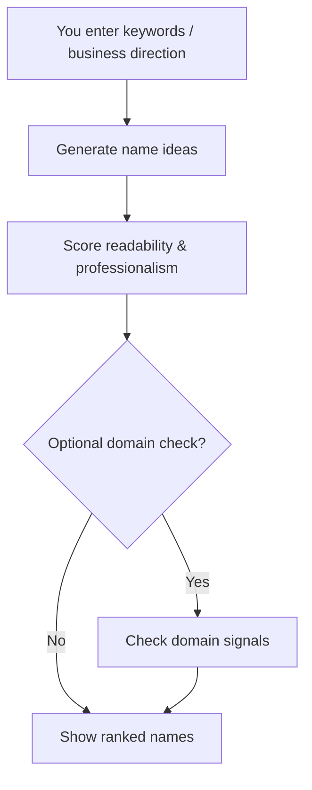
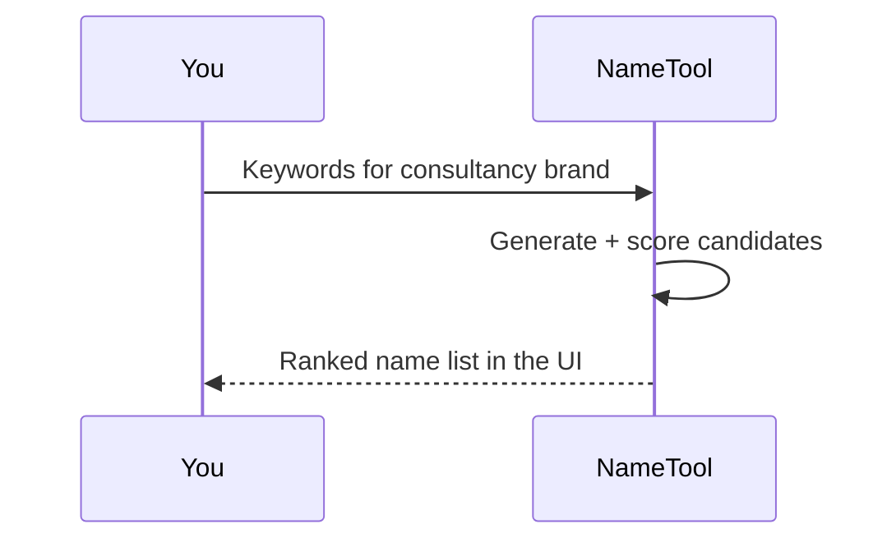

# AI Internship Portfolio — Hammad Durrani

**Author:** Hammad Durrani (HDxpert)  
**Live demos:** https://hammad-ml-dev.github.io/ai-internship-portfolio/

---

## About this portfolio

This repository is a **hands-on showcase of real internship work**: research tooling, cleaned business data, an automated restaurant lead system, and an AI business-name recommender.

It is organized by **week**. Each week is its own tool or deliverable — open the demo, clone the folder, and run it. The goal is that **anyone** (recruiter, learner, or teammate) can understand *what each tool does* and *how the work flows*, without needing to dig through code first.

**Focus of the internship**
- Research & extraction workflows  
- Pakistan SME business data  
- Lead generation automation  
- AI/ML product tooling with runnable UIs  

---

## How the internship pieces fit together



| Week | Tool | What it does for you | Open |
|------|------|----------------------|------|
| 01 | Research Tools | Documents how research/extraction tools were used | [Browse](./01-research-tools) |
| 02 | Business Datasets | 30 cleaned Pakistan business category datasets | [Browse](./02-business-datasets) |
| 03 | Restaurant Lead Pipeline | Collect → clean → score restaurant leads + web demo | [Live demo](https://hammad-ml-dev.github.io/ai-internship-portfolio/demos/restaurant-leads/) |
| 04 | Business Name Recommender | Generate & score brandable names + web demo | [Live demo](https://hammad-ml-dev.github.io/ai-internship-portfolio/demos/name-recommender/) |

---

## Week 01 — Research Tools

**About this tool (docs pack):** notes and workflows for research/extraction tools used during the internship (Nova, Thunderbit on ypages.pk, BS AI notes). Use it to understand *how* data was gathered before automation.

📁 [`01-research-tools`](./01-research-tools)

---

## Week 02 — Business Datasets

**About this tool (data pack):** 30 Excel datasets of Pakistani businesses by category (salons, clinics, restaurants, travel, security, interior design, and more) — cleaned and organized for downstream ML and lead work.

📁 [`02-business-datasets`](./02-business-datasets)

---

## Week 03 — Restaurant Lead Pipeline

### About this tool

A **lead-generation system for Pakistan restaurants**. It gathers restaurant info from multiple sources, cleans duplicates, classifies cuisine, scores how useful each lead is, and exports results — with a visual web demo so you can see the pipeline without running every CLI step.

**Who it’s for:** sales/outreach practice, data-engineering learners, recruiters who want a working automation demo.

### Lead pipeline flow





### Run the visual web app

```bash
cd 03-restaurant-lead-pipeline
python -m venv .venv
.\.venv\Scripts\Activate.ps1
pip install -r requirements.txt
pip install -r web_app/requirements.txt
python web_app/working_app.py
```

Open the URL printed (usually `http://127.0.0.1:5000`).

CLI test: `python main_pipeline.py --test` (see week README for `.env` keys).

📄 [`03-restaurant-lead-pipeline/README.md`](./03-restaurant-lead-pipeline/README.md)

---

## Week 04 — Business Name Recommender

### About this tool

An **AI-assisted naming tool for SME consultancy brands**. You enter keywords / direction; it generates brandable names, scores them for readability and professionalism, and can optionally check if a domain looks available — all with a browser UI.

**Who it’s for:** founders testing names, learners studying generative tooling, recruiters who want an interactive ML/product demo.

### Naming flow





### Run the visual web app

```bash
cd 04-business-name-recommender
python -m venv .venv
.\.venv\Scripts\Activate.ps1
pip install -r requirements.txt
pip install -e .
python -m name_recommender
```

Open `http://localhost:8000/static/index.html`.

📄 [`04-business-name-recommender/README.md`](./04-business-name-recommender/README.md)

---

## Quick clone

```bash
git clone https://github.com/hammad-ml-dev/ai-internship-portfolio.git
cd ai-internship-portfolio
```

**Repo:** https://github.com/hammad-ml-dev/ai-internship-portfolio

---

## Suggested learning path

1. Skim Week 02 datasets — see the shape of real business rows  
2. Open the [Restaurant Leads live demo](https://hammad-ml-dev.github.io/ai-internship-portfolio/demos/restaurant-leads/)  
3. Open the [Name Recommender live demo](https://hammad-ml-dev.github.io/ai-internship-portfolio/demos/name-recommender/)  
4. Clone and run one week locally  

---

## Built with

Python · Excel/CSV datasets · Flask / FastAPI web UIs · optional Maps / Domain APIs  

(Stack details for developers; each **About** section above explains the *tool*, not the stack.)

---

## License & contact

Shared publicly for learning and portfolio demonstration.  
Please credit **Hammad Durrani** if you reuse substantial parts.

Internship work by **Hammad Durrani (HDxpert)**. Open an issue if you need help running a week.
